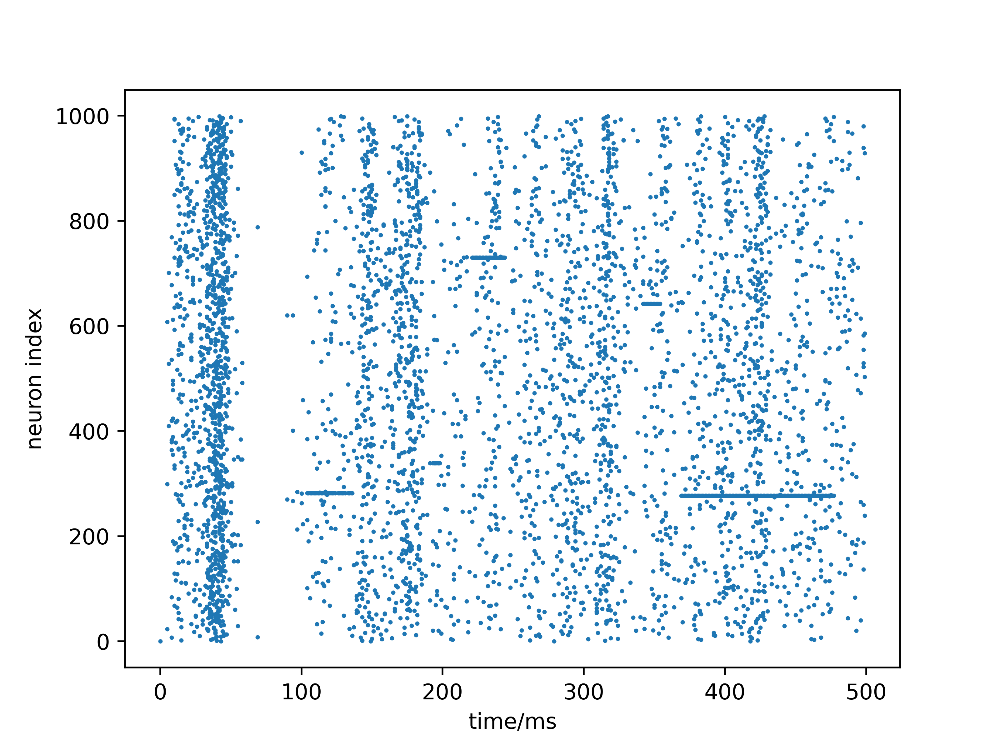

# Izhikevich-simulation
The Python simulation for Izhikevich model using Runge-Kutta Method

### Izhikevich model

### Runge-Kutta法公式

### 单神经元仿真结果

### Izhikevich神经网络仿真结果

### 各阶Runge-Kutta法仿真精度对比

### Simulation performance
- RK1 : 4.2572 ms
- RK2 : 9.5601 ms
- RK3 : 16.1879 ms
- RK4 : 19.9411 ms

### 参考文献
- Izhikevich E M . Simple model of Spiking Neurons[J]. IEEE Transactions on Neural Networks, 2003, 14(6):1569-1572.

- 龙格库塔法求解Izhikevich模型-Python https://zhuanlan.zhihu.com/p/242302501